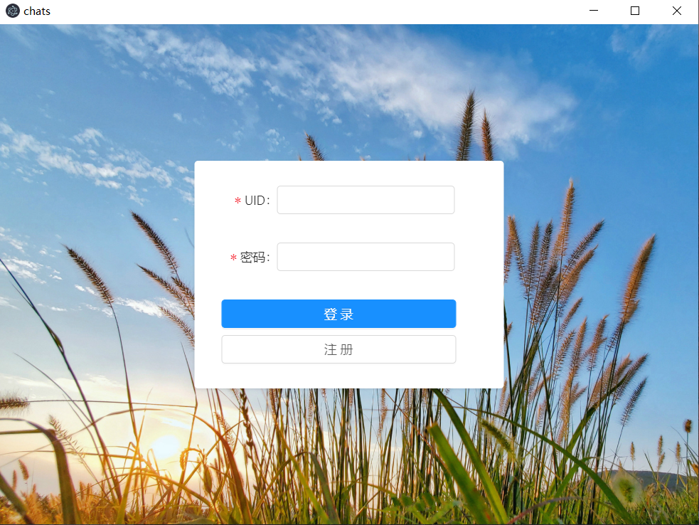
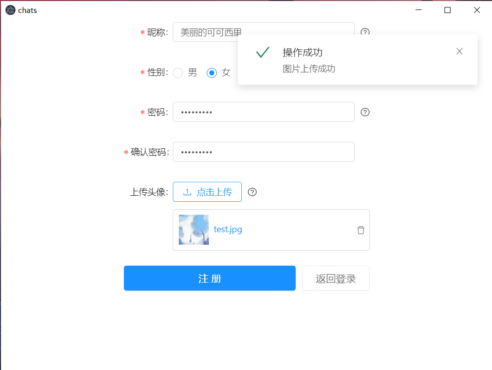
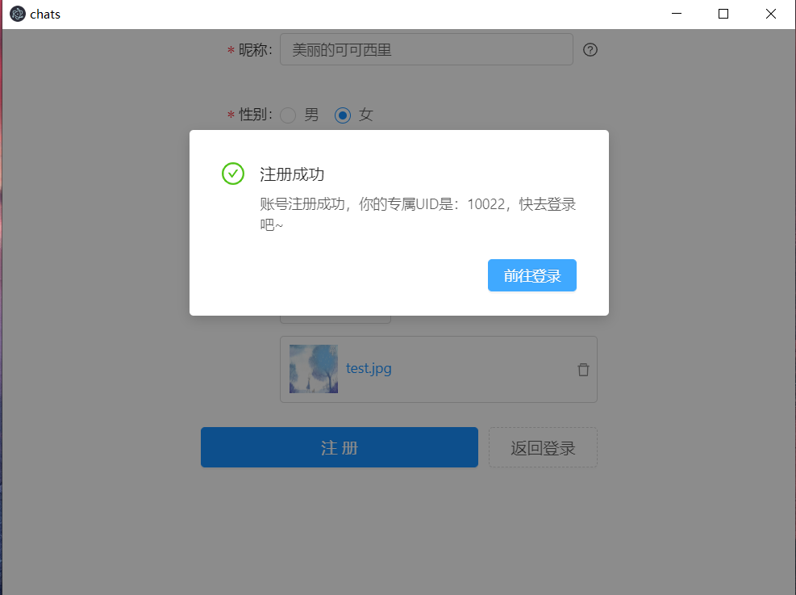
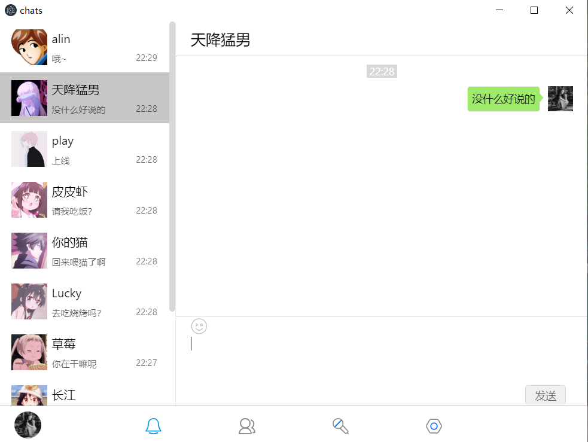
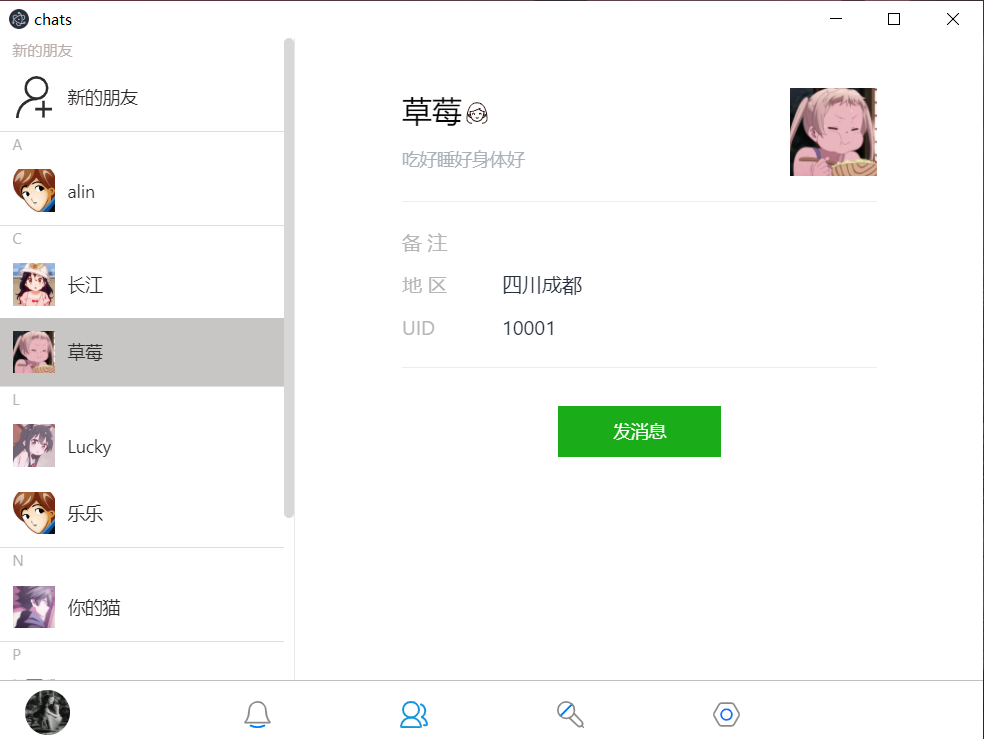
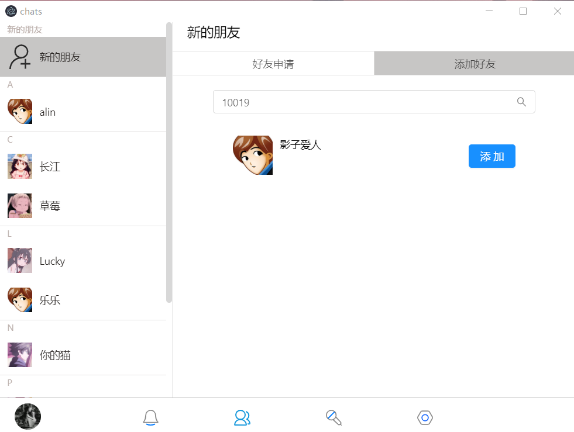
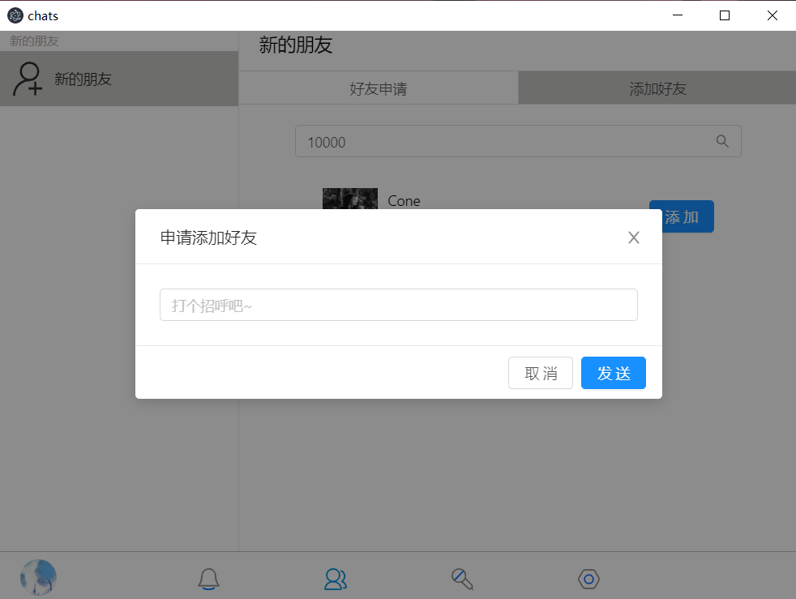
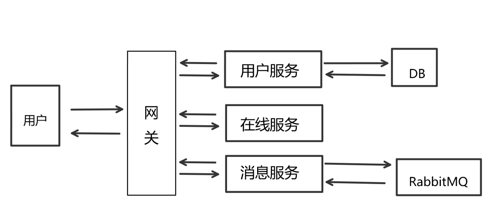

# 
**mChat**

* <a href="#项目介绍">项目介绍</a>
* <a href="#功能截图">功能截图</a>
* <a href="#系统架构">系统架构</a>

## <a name="项目介绍">项目介绍</a>
这是一个在PC运行的即时通讯工具，它目前提供如下功能：注册、登录、添加/搜索好友，聊天（文本）。技术栈如下：  
前端：Vue + Socket + Electron  
后端：Express + Redis + RabbitMQ + Mysql + Socket + Apisix

对应的仓库：[前端](https://github.com/Thinker-Mars/mChat-front)、[后端](https://github.com/Thinker-Mars/mChat-backend)

## <a name="功能截图">功能截图</a>
* 登录

	

* 注册

	

	

* 消息列表

	

* 好友列表

	

* 搜索好友

	

	

## <a name="系统架构">系统架构</a>
如下图所示：

这个项目是我对于Node微服务的一次实践，各个服务通过网关（Apisix）进行聚合。